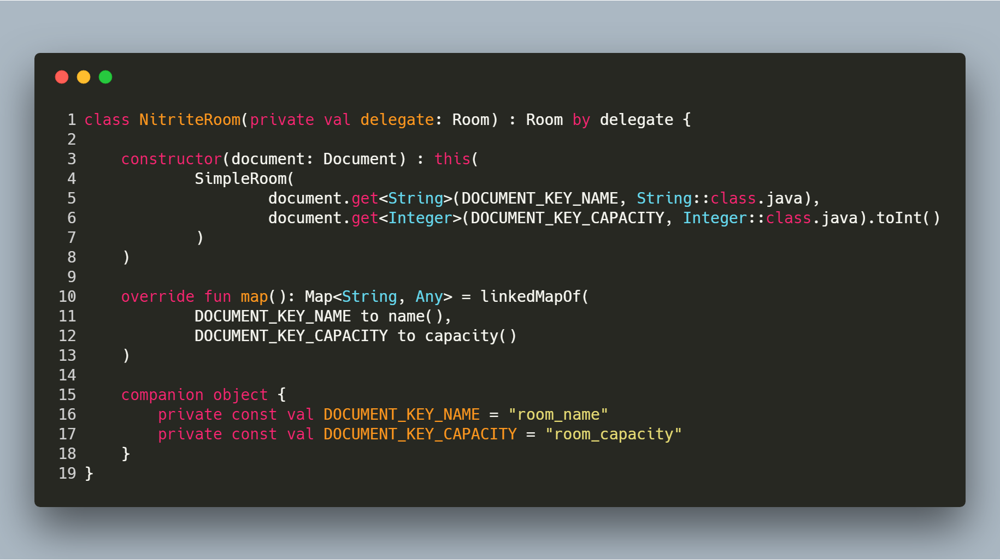

# Revisiting Composable Decorators

First, I have to warn you: I'm a huge fan of "Elegant objects", here is the proof: <https://www.elegantobjects.org/>
That's why, I unconditionally embrace the content argued in the ["Composable Decorators vs. Imperative Utility Methods"](https://www.yegor256.com/2015/02/26/composable-decorators.html) blog post.
The idea is that we need to keep objects simple and cohesive. An object embodies a dedicated feature. This way, we can "compose" them to provide a full-featured behavior. Using [design by contract](https://en.wikipedia.org/wiki/Design_by_contract) (i.e., declare an `interface` for every `class` that exposes behavior), the decorator pattern allows developers to "wrap" an existing class (conforming a contract), inside a new one (conforming the same contract) to "decorate" it with a totally new behavior. The File-based examples Yegor provides explain the idea.

Recently, coding a lightweight REST API to book rooms, I faced some typical use cases. First, I need to store data in database (for rapid prototyping concerns, I use [Nitrite](https://www.dizitart.org/nitrite-database.html) as a in-memory document store). Moreover, I need to deal with JSON data for POST and GET verbs (I use [javalin](https://javalin.io/) as web framework and standard `javax.json`). So, to separate concerns, I clearly need 2 classes, [one to deal with database content](https://www.yegor256.com/2014/12/01/orm-offensive-anti-pattern.html) and [one to deal with JSON content](https://www.yegor256.com/2018/02/27/parsing-objects.html), back and forth. To do it right, I define a contract:

```java
public interface Room {
    String name();

    int capacity();

    Map<String, Object> map();
}
```
The deal is simple, a room need a name, a capacity and I expose a map (can be saved in Nitrite's `Document`, can be returned to javalin's `Context` as a JSON response). But it's clear I'm going to repeat myself. So I made my choice: I need to use the Decorator pattern. I introduce a "simple" (dummy? maybe yes) room class as follows:

```java
public final class SimpleRoom implements Room {
    private final String name;
    private final int capacity;

    public SimpleRoom(final String name, final int capacity) {
        this.name = name;
        this.capacity = capacity;
    }

    @Override
    public String name() {
        return name;
    }

    @Override
    public int capacity() {
        return capacity;
    }

    @Override
    public Map<String, Object> map() {
        final Map<String, Object> map = new LinkedHashMap<>();
        map.put("name", name);
        map.put("capacity", capacity);
        return map;
    }
}
```

Now, I become easy to wrap it with the previous 2 implementations I need:

```java
public final class NitriteRoom implements Room {
    private static final String DOCUMENT_KEY_NAME = "room_name";
    private static final String DOCUMENT_KEY_CAPACITY = "room_capacity";

    private final Room delegate;

    public NitriteRoom(final Room delegate) {
        this.delegate = delegate;
    }

    public NitriteRoom(final Document document) {
        this(
                new SimpleRoom(
                        document.get(DOCUMENT_KEY_NAME, String.class),
                        document.get(DOCUMENT_KEY_CAPACITY, Integer.class)
                )
        );
    }

    @Override
    public String name() {
        return delegate.name();
    }

    @Override
    public int capacity() {
        return delegate.capacity();
    }

    @Override
    public Map<String, Object> map() {
        final Map<String, Object> map = new LinkedHashMap<>();
        map.put(DOCUMENT_KEY_NAME, name());
        map.put(DOCUMENT_KEY_CAPACITY, capacity());
        return map;
    }
}

public final class JsonRoom implements Room {
    // it's pretty much the same, with different constants, but I'm sure you get the point
}
```

Now I could easily write things like (with some Java `Stream` to the rescue):

```java
// create a room from a javalin's content (POST /rooms)
nitriteCollection.insert(
    new Document(
        new NitriteRoom(
            new JsonRoom(context.body())
        ).map()
    )
);

// list all the rooms to populate a javalin's content (GET /rooms)
context.json(
    nitriteCollection.find()
        .toList()
        .stream()
        .map(NitriteRoom::new)
        .map(JsonRoom::new)
        .map(JsonRoom::map)
        .collect(Collectors.toList())
)
```

It's definitely elegant objects!

Nevertheless, you'll totally agree the initial setup is cumbersome. Before changing things, [I need unit tests to secure my code base](https://www.yegor256.com/2015/07/16/fools-dont-write-unit-tests.html). I use the ["Reusable assertion"](https://pragmaticobjects.com/chapters/003_reusable_assertions.html) approach (more or less):

```java
public final class RoomTest {
    @Test
    public void testNitriteRoom() {
        new MatchersAssertion<>(
                new NitriteRoom(
                        new SimpleRoom("test", 12)
                ),
                new HasNameMatcher("test"),
                new HasCapacityMatcher(12),
                new HasMapMatcher(
                        entry("room_name", "test"),
                        entry("room_capacity", 12)
                )
        ).check();
    }
}
```

(not interesting to dig into these specific test classes implementations)

Now I have my test harness, I can change things to something better. And it's called Kotlin! I'm going to take advantages of the ["Implementation by Delegation" concept](https://kotlinlang.org/docs/reference/delegation.html#implementation-by-delegation). It will decrease significantly the code base. Here is the proof:

```kotlin
class NitriteRoom(private val delegate: Room) : Room by delegate {

    constructor(document: Document) : this(
            SimpleRoom(
                    document.get<String>(DOCUMENT_KEY_NAME, String::class.java),
                    document.get<Integer>(DOCUMENT_KEY_CAPACITY, Integer::class.java).toInt()
            )
    )

    override fun map(): Map<String, Any> = linkedMapOf(
            DOCUMENT_KEY_NAME to name(),
            DOCUMENT_KEY_CAPACITY to capacity()
    )

    companion object {
        private const val DOCUMENT_KEY_NAME = "room_name"
        private const val DOCUMENT_KEY_CAPACITY = "room_capacity"
    }
}
```

19 lines of code in Kotlin versus 37 in Java.
All the boilerplate code (repeating overridden methods to just call the delegate's ones) disappear. 
Moreover, there is a clear distinction between [the primary constructor and the secondaries](https://www.yegor256.com/2015/05/28/one-primary-constructor.html). It's an indirect design improvement from this Kotlin migration, I think.
And all my test harness stay green.

See the difference side by side:

The Java way             |  The Kotlin way
:-------------------------:|:-------------------------:
  |  

As a conclusion, no conclusion: the code is expressive by itself! Concise, efficient, relevant... cool! I'm loving it!

All the code is available here: <https://github.com/RoRoche/RoomBookingsBackEnd/tree/improvement/kotlin_migration>

## References

- "Composable Decorators vs. Imperative Utility Methods", by Yegor Bugayenko: <https://www.yegor256.com/2015/02/26/composable-decorators.html>
- "Design by contract", Wikipedia: <https://en.wikipedia.org/wiki/Design_by_contract>
- "ORM Is an Offensive Anti-Pattern", by Yegor Bugayenko: <https://www.yegor256.com/2014/12/01/orm-offensive-anti-pattern.html>
- "Don't Parse, Use Parsing Objects", by Yegor Bugayenko: <https://www.yegor256.com/2018/02/27/parsing-objects.html>
- "Fools Don't Write Unit Tests", by Yegor Bugayenko: <https://www.yegor256.com/2015/07/16/fools-dont-write-unit-tests.html>
- "Reusable assertions", by Sergey Kapralov: <https://pragmaticobjects.com/chapters/003_reusable_assertions.html> 
- "Implementation by Delegation", Kotlin Official Documentation: <https://kotlinlang.org/docs/reference/delegation.html#implementation-by-delegation>
- "There Can Be Only One Primary Constructor", by Yegor Bugayenko: <https://www.yegor256.com/2015/05/28/one-primary-constructor.html>